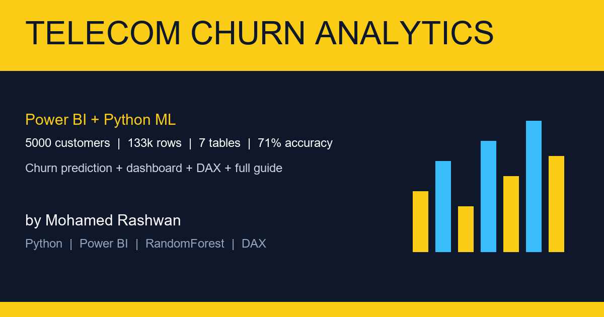

# Telecom Churn Analytics — Power BI + Python ML

Built by Mohamed Rashwan — telecom customers churn prediction. I made a full fake dataset (5000 customers, 133k rows), Power BI dashboard plan with DAX, and a RandomForest model that predicts who will leave.

Live preview: open `dashboard_preview/index.html` in your browser. Full simple guide: `docs/Telecom_Churn_Simple_Guide.pdf`.

## 1) Run it (Windows, 2 minutes)

Double-click **`run.bat`** — it installs libs and rebuilds everything. Full steps below if you want manual.

```bat
py -m venv venv
.\venv\Scripts\activate
pip install -r requirements.txt
py make_dataset.py
py build_analysis_ml.py
py ml\predict.py
```

- Preview: open `dashboard_preview/index.html`
- Charts: `analysis/charts/`
- Model score: `ml/metrics.json` (acc ~71%, AUC ~0.78)

**Python not working?** Use `py` not `python`. If you see Microsoft Store error, install from python.org and tick ADD TO PATH. Run from inside this folder (the one with `make_dataset.py`).

## 2) Power BI (10 minutes)

1. Open Power BI Desktop > Get Data > load all 7 CSVs from `data/`
2. Check types with `powerbi/PowerQuery_M.m`
3. Model view > make links like in `powerbi/data_model_and_dashboard.md`
4. Paste measures from `powerbi/DAX_measures.dax`
5. Build 5 pages: Overview, Customer, Usage, Support, Prediction
6. For prediction page: run `py ml/predict.py --input data/new_customers.csv --output data/predictions.csv` then load `predictions.csv`

No .pbix committed (it is binary). You build it in 10 min from the CSVs + DAX.

## 3) Scope — اللي اتنفذ

`data/` 7 tables (customers, subscriptions, usage_monthly 60k, billing 60k, support_tickets 8.5k, network_quality, churn_labels) + `data_dictionary.csv` + analysis charts (13 imgs) + ML model (`model.pkl` + `predict.py`) + Power BI DAX + M + model doc + HTML preview + PDF guide.

> `venv/`, `__pycache__/` are never committed (see `.gitignore`).

## 4) Design notes

Star schema so Power BI is fast. Churn logic is realistic: month-to-month + electronic check + fiber downtime + late payments + low satisfaction = high churn. Model uses RandomForest (200 trees) — simple, strong, easy to explain. Top drivers: bill amount, monthly charge, usage, tenure, downtime.

## Files

```
data/                 7 CSVs + dictionary + predictions.csv
powerbi/              DAX + M + dashboard plan
ml/                   model.pkl + metrics.json + predict.py
analysis/charts/      13 PNGs + summary.json
dashboard_preview/    index.html (static Power BI look)
docs/                 PDF guide + references
```

## References

See `docs/references.md` + PDF last page. Main: Microsoft Power BI docs, scikit-learn docs, telecom churn papers.
